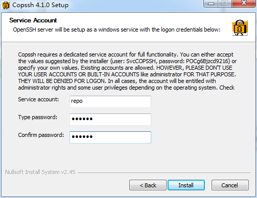
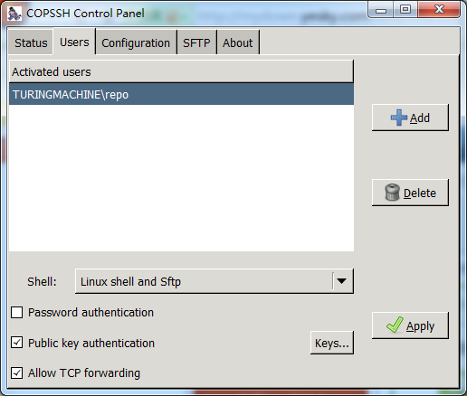
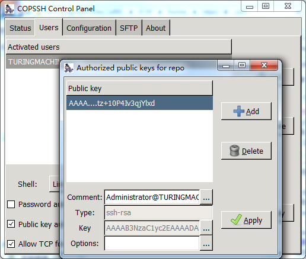

# Git Manual
----------
## windows下搭建git服务器
### 所需工具
1. msysgit(服务器端、客户端都需要安装)
2. copssh(服务器端安装)
### windows配置
1. 安装copssh时，会提示设置service account。假定新建的用户名为repo，即将在windows下创建一个名为repo的用户；

2. 修改计算机名，假定计算机名为TuringMachine。设定了计算机名后，git的远程访问可以用TuringMachine来代替IP地址。
### 生成ssh密钥/公钥
打开git bash命令窗口。在窗口中输入`ssh-keygen -t rsa`。之后，会需要输入口令密码，这里只需连续三次回车，将所有口令密码设为空即可。密钥/公钥会生成在c:\user\Administrator\.ssh文件夹下，即id\_rsa和id\_rsa.pub。把你的公钥添加给服务器，即可访问服务器端。
### copssh配置
1. 添加仓库

打开COPSSH Control Panel。
切换到Users选项卡。首次设置Activated users下应为空，点击Add按钮。
在select a user步骤，user选择之前设置的repo。在select options步骤，去掉Allow password authentication选项。点击完成后，此时COPSSH Control Panel中会出现repo用户。

2. 添加公钥

此时，打开COPSSH安装目录下的home文件夹，会发现里面有新建的repo用户文件夹。在repo/.ssh下新建authorized\_keys文件，并将之前生成的id\_rsa.pub文件内容复制到authorized\_keys文件中。这样就设置好了COPSSH的公钥，新增加用户机器使用相同的方式增加公钥。

打开COPSSH Control Panel/Users下的keys选项，可以看到新增加的公钥。

打开git bash命令窗口，输入`ssh repo@turingmachine`	可以看到ssh远程连接成功。说明已经配置好了访问公钥。
### ssh远程访问增加git命令
虽然ssh可以远程访问repo@turingmachine，但是在远程状态下还不能使用git命令。

解决方式如下：

1. 将$ Git\libexec\git-core目录下的git.exe , git-receive-pack.exe , git-upload-archive.exe , git-upload-pack.exe复制到$ICW\bin目录下。
2. 将$Git\bin目录下的libiconv-2.dll复制到$ICW\bin目录下
将$Git下的share目录整个拷贝到$ICW下。

其中，$Git是指msysgit的安装目录  ，同理$ICW指COPSSH的安装目录。

完成上述步骤后，已经可以在ssh状态下使用git命令。到此，windows下git的远程服务器已经搭建完成！
## git常用命令
